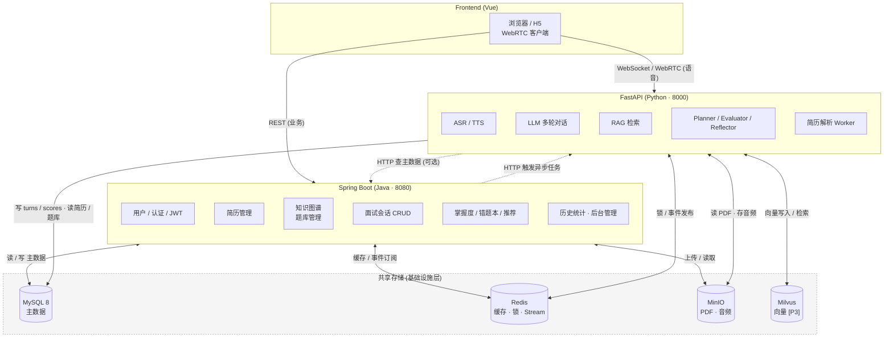
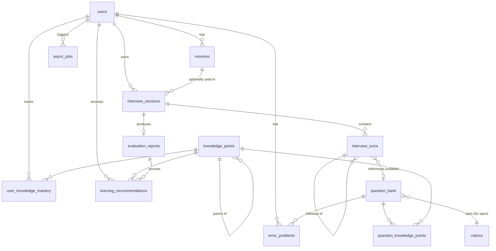
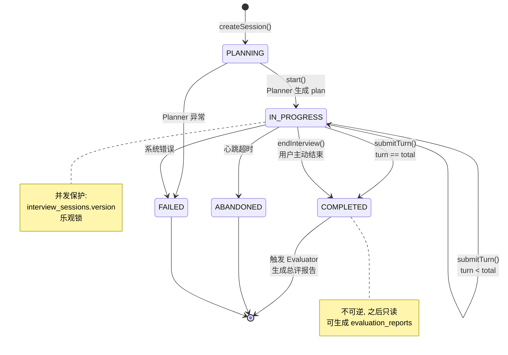

# 架构设计文档

> 版本：v1.0（2026-04-23）
> 状态：**本文档是当前唯一权威架构说明**。`docs/` 目录下 `PROJECT_STRUCTURE.md`、`FILE_INVENTORY.md`、`DIRECTORY_STRUCTURE.md`、`DELIVERY_SUMMARY.md`、`QUICK_START.md`、`QUICK_REFERENCE.md` 均为旧版本，**已过时，不要参考**。

---

## 目录

- [1. 项目定位与目标](#1-项目定位与目标)
- [2. 总体架构](#2-总体架构)
- [3. Java / Python 职责划分](#3-java--python-职责划分)
- [4. 数据模型概览](#4-数据模型概览)
- [5. 核心业务流程](#5-核心业务流程)
- [6. 安全与用户隔离](#6-安全与用户隔离)
- [7. 技术栈](#7-技术栈)
- [8. 部署拓扑](#8-部署拓扑)
- [9. 非目标（明确不做）](#9-非目标明确不做)
- [10. 演进路线（Phase 1–5）](#10-演进路线phase-15)
- [11. 决策记录](#11-决策记录)

---

## 1. 项目定位与目标

### 1.1 三重定位

本项目同时服务三种身份：

| 身份 | 诉求 | 由此得出的约束 |
|---|---|---|
| **求职作品集** | 展示 Java 工程能力 + Agent 算法能力 | 亮点 > 功能数量；论文级建模 > 企业级中间件堆砌 |
| **Agent 学习载体** | 作者要在实战中掌握 RAG / Memory / 多轮对话 / 评分 | Python 侧实现必须是"真 Agent"，不是 LLM 套壳 |
| **师弟师妹可用产品** | 实际能用来练面试 | 稳定性 + UI 体验 > 任何花哨特性 |

### 1.2 目标用户

- **面向 C 端个人**：计算机相关专业的研究生、求职者、在职转岗者
- **规模预期**：单机部署，QPS < 10，并发面试会话 < 50
- **不做多租户**：无 `organizations` 概念；JWT 里不带 `org_id`

### 1.3 核心能力（最终形态）

1. 上传 PDF 简历 → 自动解析与知识点抽取
2. 基于简历 + 目标方向 → Agent 生成个性化面试计划
3. 多轮交互式面试（文本 / 语音）
4. 多维度自动评分 + 点评 + 知识点漏洞定位
5. 用户画像：技能画像、知识掌握度（贝叶斯）、错题本
6. 自适应出题（针对薄弱点）+ 个性化学习推荐
7. 完整闭环：**面试 → 评估 → 复盘 → 强化 → 再面试**

### 1.4 支持的技术方向

后端、前端、AI/算法、大数据、云原生。知识图谱按方向分支组织（详见 `DATA_MODEL.md`）。

---

## 2. 总体架构

### 2.1 架构图



<details>
<summary>ASCII 版（若阅读器不支持 Mermaid）</summary>

```
                          ┌──────────────────────────────┐
                          │        Frontend (Vue)        │
                          │   浏览器 / H5 / WebRTC 客户端 │
                          └──────┬──────────────┬────────┘
                                 │              │
                   REST (业务)   │              │  WebSocket/WebRTC (实时语音)
                                 │              │
                      ┌──────────▼─────┐  ┌────▼────────────────┐
                      │ Spring Boot    │  │  FastAPI (Python)   │
                      │ (Java, 8080)   │  │  AI Agent (8000)    │
                      │                │  │                     │
                      │ 业务中枢:      │  │ AI 能力层:          │
                      │ - 用户/认证    │  │ - ASR (Whisper)     │
                      │ - 简历管理     │  │ - LLM 多轮对话      │
                      │ - 知识图谱     │  │ - TTS (Edge-TTS)    │
                      │ - 题库管理     │  │ - RAG / 向量检索    │
                      │ - 会话 CRUD    │  │ - 评分 (Judge)      │
                      │ - 掌握度计算   │  │ - Planner/Reflector │
                      │ - 错题本       │  │ - 简历解析          │
                      │ - 学习推荐     │  │                     │
                      │ - 历史统计     │  │ 写入: turns/scores  │
                      │ - 后台管理     │  │ 读取: 简历/题库     │
                      └────┬───────────┘  └──────┬──────────────┘
                           │                     │
                           │  读 / 写            │  读 / 写
                           ▼                     ▼
                   ┌──────────────────────────────────────────┐
                   │          共享存储 (基础设施层)           │
                   │  MySQL 8    - 关系数据 (主)              │
                   │  Redis      - 缓存 / 分布式锁 / 消息流   │
                   │  MinIO      - 简历 PDF / 音频文件        │
                   │  Milvus     - 向量存储 (Python 侧直写)   │
                   └──────────────────────────────────────────┘
```

</details>

### 2.2 核心架构决策：双后端并行，不是串联

**决策**：前端同时直连 Java 和 Python 两个后端。Java 不做 Python 的 HTTP 代理。

**理由**：

1. **延迟问题**：语音流经过 Java 会多一跳 TCP + JVM，每个 chunk 多 50–200 ms，对实时语音交互不可接受。
2. **职责清晰**：Java 代理 Python 只是多一层转发，不产生业务价值；两边薄薄各做一点是最差组合。
3. **故障隔离**：Java 挂了不影响正在进行的面试；Python 挂了不影响历史查询和登录。
4. **开发独立**：前后端约定好接口即可各自开发部署。

**代价**：前端要同时维护两个 base URL、两套错误处理。这是可接受的成本。

### 2.3 数据一致性保证

Java 和 Python 共享 MySQL。一致性靠：

- **MySQL 事务 + 乐观锁**：`interview_sessions.version` 防止两侧并发修改冲突。
- **Redis 分布式锁**：同一个 `session_id` 同时只允许一条 WebSocket 处理中。
- **单向写入约定**：每张表只由一侧写（见 §3.3），避免双边写竞争。
- **Redis Stream 事件**（Phase 3+）：Python 完成评分后发 `turn.scored` 事件，Java 消费并更新掌握度/错题本。

---

## 3. Java / Python 职责划分

### 3.1 划分原则

> **"按数据生命周期切分，不按功能切分"**
>
> - 数据的**主数据管理、事务、查询、报表** → Java
> - 数据的**AI 推理产出、实时流处理** → Python

### 3.2 模块职责对照表

| 模块 | Java | Python | 说明 |
|---|:---:|:---:|---|
| 用户注册 / 登录 / JWT | ✅ | — | 认证信息不出 Java |
| 简历 PDF 接收 + 存 MinIO | ✅ | — | 接到文件立即建 `async_jobs` |
| 简历 PDF 解析 + 结构化 | — | ✅ | 读 MinIO → 写回 `resumes.parsed_content` |
| 简历 embedding 生成 | — | ✅ | 写 Milvus + `resumes.embedding_ref` |
| 知识图谱 CRUD（后台） | ✅ | — | 管理员操作树形结构 |
| 题目库 CRUD + 审核流 | ✅ | — | 管理员操作 |
| 题目 embedding 生成 | — | ✅ | 批量任务，通过 `async_jobs` 触发 |
| 面试 session 创建 / 列表 / 详情 | ✅ | — | 前端查询入口 |
| 面试实时交互（WS + 语音） | — | ✅ | 前端直连 |
| ASR / LLM 对话 / TTS | — | ✅ | 纯 AI 能力 |
| RAG 检索 | — | ✅ | 向量 + BM25 混合 |
| 评分（LLM-as-judge） | — | ✅ | 多维度 rubric 调用 |
| 写入 `interview_turns` / `score_detail` | — | ✅ | **Python 是唯一写者** |
| 读取 `interview_turns` 做报表 | ✅ | — | |
| 掌握度 Beta 更新 | ✅ | — | Java 消费评分事件，做贝叶斯计算 |
| 错题本维护 | ✅ | — | 消费评分事件 |
| 学习推荐生成 | ✅ | ✅ | Java 编排 + Python 生成推荐文案 |
| 评估报告聚合（`evaluation_reports`） | — | ✅ | 面试结束时由 Python 生成写入 |
| 历史查询 / Dashboard | ✅ | — | 标准业务查询 |
| 后台管理界面（管理员） | ✅ | — | 知识点/题目/用户管理 |

### 3.3 通信方式

| 方式 | 使用场景 | 优先级 |
|---|---|---|
| **共享 MySQL** | Python 写 turn + score，Java 读 | 首选，最稳 |
| **Redis Pub/Sub 或 Stream** | Python 完成一轮 → Java 实时更新掌握度 | Phase 3 引入 |
| **HTTP: Java → Python** | 触发异步任务（"解析这份简历"） | 仅用于触发 |
| **HTTP: Python → Java** | 查主数据（"该 user 的 active 简历 id"） | 仅用于查询 |
| **❌ Java 转发 WebSocket 给 Python** | 绝不使用 | 延迟无法接受 |

**关键原则**：每张表的**写入方**唯一，避免双边并发写竞争。详见 §3.2 对照表。

---

## 4. 数据模型概览

> 完整字段定义见 `backend/src/main/resources/db/migration/V1__init_schema.sql`。
> 核心表的设计动机和 JSON schema 见 `DATA_MODEL.md`（TODO）。

### 4.1 表清单（13 张）

```
业务主数据   (2)  users, resumes
知识与题库   (4)  knowledge_points, rubrics, question_bank, question_knowledge_points
面试过程     (2)  interview_sessions, interview_turns
学习闭环     (4)  user_knowledge_mastery, error_problems,
                  evaluation_reports, learning_recommendations
基础设施     (1)  async_jobs
```

### 4.2 表关系（简化 ER）



<details>
<summary>ASCII 简图（阅读器兼容）</summary>

```
users ──┬─< resumes
        ├─< interview_sessions ──< interview_turns ──> question_bank
        │            │                                      │
        │            └──> evaluation_reports                 │
        │                                                    │
        ├─< user_knowledge_mastery ──> knowledge_points <────┤
        │                                                    │
        ├─< error_problems ─────> question_bank              │
        │                                                    │
        ├─< learning_recommendations ──> knowledge_points    │
        │                                                    │
        └─< async_jobs                                       │
                                                             │
        rubrics <──────────────────────────────────── question_bank
```

</details>

### 4.3 关键设计决策

| 决策 | 选择 | 理由 |
|---|---|---|
| 主键类型 | `BIGINT UNSIGNED AUTO_INCREMENT` | 索引紧凑、B+Tree 写入有序；UUID 只在 API 层对外需要时单独加字段 |
| 结构化文本 | MySQL 8 原生 `JSON` | 支持 `JSON_EXTRACT` 查询和生成列，弃用 `LONGTEXT` 存 JSON 反模式 |
| 向量存储 | **不入 MySQL**，仅保留 `embedding_ref` 外部 id | Milvus / pgvector 专用；MySQL 8 对向量支持有限 |
| 知识点引用 | 用语义 `code`（如 `backend.network.tcp.handshake`） | 跨环境迁移稳定；LLM prompt 可读；`id` 仅内部使用 |
| 贝叶斯掌握度 | `Beta(alpha, beta)` + 生成列 `mastery_mean` | 真正的贝叶斯更新，可索引排序找薄弱点 |
| 软删除范围 | 仅 `users / resumes / question_bank` | 流水/派生表不做，避免全局 `WHERE deleted_at IS NULL` 负担 |
| 评分统一 schema | `interview_turns.score_detail` JSON | 事实类 + 开放类同结构，下游代码统一消费 |

### 4.4 最关键的一个字段：`interview_turns.score_detail`

整个系统闭环的枢纽。统一 schema：

```json
{
  "scoring_type": "factual | open",
  "dimensions": {
    "correctness": {"score": 4, "reason": "..."},
    "depth":       {"score": 3, "reason": "..."},
    "expression":  {"score": 4, "reason": "..."}
  },
  "overall_score": 3.7,
  "knowledge_points": [
    {"kp_code": "backend.network.tcp.handshake",  "status": "hit"},
    {"kp_code": "backend.network.tcp.syn_flood",  "status": "miss"}
  ],
  "feedback": {
    "strengths":  ["..."],
    "weaknesses": ["..."],
    "suggested_followup_kps": ["backend.network.tcp.syn_flood"]
  },
  "rubric_scores": { ... }
}
```

**下游消费逻辑完全无差别**：
- 错题本：`status=miss` 的题目（或 overall_score<2.5）入本
- 掌握度：遍历 `knowledge_points`，按 hit/partial/miss 做贝叶斯更新
- 推荐：`suggested_followup_kps` + 低掌握度 KP → 推荐学习资源

---

## 5. 核心业务流程

### 5.1 用户注册 → 上传简历 → 生成技能画像

```
用户注册 [Java]
   └──> 写 users
用户上传 PDF [Java]
   ├──> 存 MinIO (file_path)
   ├──> 写 resumes (analysis_status=PENDING)
   └──> 写 async_jobs (job_type=resume_parse)
          │
          │ [Python Worker 轮询/订阅]
          ▼
       Python 拉取任务
          ├──> 下载 PDF
          ├──> PyPDF / PDFMiner 提取文本
          ├──> LLM 抽取结构化字段 → parsed_content
          ├──> 匹配知识点 → mentioned_kps
          ├──> 生成 embedding → Milvus
          ├──> 更新 resumes (analysis_status=PARSED)
          └──> 更新 async_jobs (status=SUCCESS)

前端轮询 async_jobs 状态，看到 SUCCESS 后跳转
```

### 5.2 面试会话的状态机



<details>
<summary>ASCII 版</summary>

```
           ┌─────────────┐
           │  PLANNING   │ ← 用户创建会话后，Planner Agent 生成 plan JSON
           └──────┬──────┘
                  │ start()
                  ▼
           ┌─────────────┐
           │ IN_PROGRESS │ ← 每 submit_turn() 推进一轮
           └──────┬──────┘
                  │
                  ├── turn < total_turns ──► (保持 IN_PROGRESS)
                  │
                  ├── turn == total_turns ──┐
                  │                          ▼
                  │                    ┌───────────┐
                  │                    │ COMPLETED │ → 触发 Evaluator 生成总评报告
                  │                    └───────────┘
                  │
                  ├── 用户主动结束 ──► COMPLETED
                  │
                  ├── 超时无响应 ────► ABANDONED
                  │
                  └── 系统错误 ─────► FAILED
```

</details>

**实现要点**：
- 每次状态转移必须校验当前状态合法性
- 并发提交用 `version` 字段乐观锁
- 非法跃迁抛 `IllegalSessionStateException`（400）

### 5.3 单轮交互（语音模式，Phase 4 后）

```
  [前端]                [Python WS]             [共享存储]
    │                       │                         │
    │──── 连接 /ws/interview?token=xxx ───►│
    │                       │                         │
    │◄── session_attached ──│                         │
    │                       │                         │
    │── start_turn{session_id} ──►│                  │
    │                       │                         │
    │                       │── 读 plan 取下一题 ──►│
    │                       │◄── question ──────────│
    │                       │                         │
    │                       │── TTS 合成 ────────────►(缓冲)
    │◄── audio_chunks stream│                         │
    │                       │                         │
    │── user_audio_chunks ──►(VAD 检测说完)          │
    │                       │                         │
    │                       │── ASR ────────────────►│
    │                       │── LLM 评分 ───────────►│
    │                       │                         │
    │                       │── 写 interview_turns ──►│
    │                       │   score_detail JSON    │
    │                       │                         │
    │                       │── Redis publish ──────►│
    │                       │   turn.scored          │
    │◄── turn_scored{...} ──│                         │
    │                       │                         │
    │                       │      [Java 订阅者]     │
    │                       │      ├──> 更新掌握度  │
    │                       │      └──> 更新错题本  │
```

### 5.4 贝叶斯掌握度更新

`user_knowledge_mastery` 表的更新规则（由 Java 侧 `KnowledgeMasteryService` 执行）：

```
先验:   Beta(alpha_0=1, beta_0=1)   # 等价于 Uniform(0,1)

每次评分对涉及的每个 KP 计算 evidence:
  hit     → evidence = 1.0
  partial → evidence = 0.5
  miss    → evidence = 0.0

可靠度 reliability ∈ [0.3, 1.0]:
  = clamp(asr_confidence × question_difficulty_weight)

更新:
  alpha += evidence * reliability
  beta  += (1 - evidence) * reliability
  observations += 1

后验均值 (生成列):
  mastery_mean = alpha / (alpha + beta)

间隔复习 (SM-2 简化):
  score >= 4  → interval *= 2
  score <  2  → interval = 1
  next_review_at = now() + interval days
```

**可写进论文的点**：贝叶斯知识追踪（BKT）+ 自适应间隔复习（SRS）在面试场景的应用。

### 5.5 自适应出题（Phase 3）

详见 `AGENT_DESIGN.md` §3。简要流程：

```
读取 user_knowledge_mastery
  └─> 筛选 mastery_mean < 0.5 的 KP（薄弱点）

候选题生成（3 路并行）:
  Path A: 题库向量检索 top-K 相关题
  Path B: LLM 基于简历项目生成深追问
  Path C: 题库按 KP + 难度范围检索

去重（embedding 相似度 + 同 KP 过滤）
  └─> LLM 做最终 ranking 与改写
        └─> 输出本轮问题
```

---

## 6. 安全与用户隔离

### 6.1 当前的隔离机制（C 端 + 开源定位下的最小集合）

1. **JWT 无状态鉴权**：`user_id` + `exp` + `iat`，HS512 + 256bit secret（从环境变量读取）
2. **应用层归属校验**：所有数据查询带 `WHERE user_id = ?`，Repository 层强制
3. **统一权限入口**：`LoginUserContextService.requireUserId()` 在 Service 层首行调用
4. **外键级联**：`ON DELETE CASCADE` 保证用户删除后所有私有数据清除

### 6.2 明确不做的事

- ❌ `org_id` 多租户（已从 JWT 和代码中删除）
- ❌ PostgreSQL RLS（MySQL 不支持，且 C 端不需要）
- ❌ AOP 自动补 `WHERE user_id`（代码可读性差，选择显式）
- ❌ 行级加密

### 6.3 WebSocket 鉴权

前端 WS 连接 URL：`ws://host/ws/interview?token=<JWT>`

Python 侧 WS 握手拦截器流程：
1. 从 query string 取 `token`
2. 校验签名 + 过期
3. 解析出 `user_id`，塞进 `websocket.scope["user_id"]`
4. 所有后续消息处理函数直接读 scope，不依赖 ThreadLocal

### 6.4 其他必须做的安全措施

- JWT Secret 来自环境变量 `JWT_SECRET`，**禁止** yml 写死
- 密码使用 BCrypt（cost=10）
- 登录接口加速率限制（IP 维度，5 次/分钟）
- 简历 PDF 存储后校验 MIME + 文件头，防止上传可执行文件
- `@CrossOrigin("*")` 删除，改为 SecurityConfig 统一配置

---

## 7. 技术栈

### 7.1 Java 端

| 组件 | 版本 | 用途 |
|---|---|---|
| Java | 17 LTS | 运行时 |
| Spring Boot | 3.2.x | Web 框架 |
| Spring Security | 6.x | 认证/授权 |
| Spring Data JPA | 3.x | ORM |
| MySQL Connector | 8.x | DB 驱动 |
| Flyway | 10.x | Schema 迁移 |
| jjwt | 0.12.x | JWT |
| PDFBox | 3.0 | （备用）PDF 解析 |
| Redisson | 3.x | 分布式锁 |
| Lombok | 最新 | 减少样板 |
| springdoc-openapi | 2.x | API 文档 |

### 7.2 Python 端

| 组件 | 版本 | 用途 |
|---|---|---|
| Python | 3.11+ | 运行时 |
| FastAPI | 0.110+ | Web 框架 |
| Uvicorn | — | ASGI 服务器 |
| LangChain / LangGraph | 最新 | Agent 编排 |
| OpenAI SDK / DeepSeek SDK | — | LLM 调用 |
| faster-whisper | — | ASR（本地） |
| edge-tts | — | TTS |
| sentence-transformers | — | embedding |
| pymilvus | — | 向量库客户端 |
| SQLAlchemy | 2.x | ORM（读写 MySQL） |
| Alembic | — | （仅读配置，不管迁移） |
| redis-py | — | Redis 客户端 |
| minio | — | 对象存储 |

### 7.3 基础设施

| 组件 | 用途 | Phase |
|---|---|---|
| MySQL 8.0 | 主数据库 | P1 |
| Redis 7 | 缓存、分布式锁、消息流 | P1 |
| MinIO | 对象存储（简历/音频） | P1 |
| Milvus 2.4 | 向量存储 | P3 |

---

## 8. 部署拓扑

### 8.1 本地开发

```
docker-compose.yml:
  - mysql:8.0
  - redis:7
  - minio:latest
  - milvus:2.4            (Phase 3 引入)

本机启动:
  - Java Spring Boot   (IDE)
  - Python FastAPI     (uvicorn --reload)
  - Frontend Vite dev  (npm run dev)
```

### 8.2 单机生产部署（给师弟师妹用的目标形态）

```
单台服务器 (4C8G 起步):
  - systemd: spring-boot.service
  - systemd: python-agent.service
  - systemd: nginx.service (反向代理 + 静态前端)
  - docker:  mysql / redis / minio (持久卷)

Nginx 路由:
  /api/*         → Java 8080
  /ws/*          → Python 8000 (WebSocket upgrade)
  /py/*          → Python 8000 (REST)
  /*             → 静态前端
```

### 8.3 未来扩展（不在当前范围）

- Kubernetes 部署
- 多 Python Worker 水平扩展
- 读写分离 / 分库分表
- CDN 音频加速

---

## 9. 非目标（明确不做）

> 列出"不做"和列出"做"同样重要。避免后期偏离。

- ❌ 多租户 / `org_id` / 组织架构
- ❌ PostgreSQL RLS 或其他数据库级行级安全
- ❌ 商业化计费 / 订阅 / 支付
- ❌ SaaS 多区域部署
- ❌ Kubernetes / 云原生复杂编排
- ❌ 分布式事务（Seata、TCC 等）
- ❌ 消息队列（Kafka/RabbitMQ） —— Redis Stream 够用
- ❌ 全栈微服务拆分（Java 永远是单体）
- ❌ 视频面试 / 表情分析 / 姿态识别
- ❌ 实时语音打断（Phase 5 锦上添花，非承诺）
- ❌ 面试官多人格 / 多 Agent 对战
- ❌ 题库自动从公网爬取（版权风险，可手工导入）

---

## 10. 演进路线（Phase 1–5）

### Phase 0：基础重构（1 周）
- [x] 推翻旧 schema，落地新 `V1__init_schema.sql`
- [x] 写新架构文档（本文档）+ AGENT_DESIGN.md + ENTITY_PLAN.md + PHASE0_GUIDE.md
- [x] 旧文档归档到 `docs/legacy/`
- [x] 删除 `org_id`、重构全部 Entity（10 个）和 Repository（B-1）
- [x] 改造 JWT（移除 org_id + userId 改 Long）
- [x] WebSocket 鉴权修复（JwtHandshakeInterceptor + session attributes）（B-2）
- [x] 配置项安全化（application.yml 改环境变量 + .env.example + docker-compose.yml）（B-3）

### Phase 1：文本 MVP 闭环（2–3 周）
目标：**一个用户能从注册走到看到面试评估报告**，全程文本，不涉及语音。

- [ ] Java：Auth / Resume 上传 / Session CRUD / Turn 查询
- [ ] Python：Resume 解析 worker / LLM 对话 / LLM 评分
- [ ] Java：Turn 评分事件消费 → 更新 `user_knowledge_mastery` 和 `error_problems`
- [ ] Python：面试结束后生成 `evaluation_reports`
- [ ] 最小前端：登录、上传简历、创建会话、问答、查看报告

**产出**：一个能端到端跑通的 Demo，足以写进简历。

### Phase 2：知识图谱与题库（2 周）
目标：**师弟师妹能真的用起来**。

- [ ] Java：知识图谱 CRUD 管理后台
- [ ] Java：题库审核工作流
- [ ] 手工种子 200 题：后端方向
- [ ] LLM + 人工扩展：AI 方向 200 题
- [ ] Python：题目 embedding 批量生成

### Phase 3：自适应与推荐（2–3 周）
目标：**论文级亮点落地**。

- [ ] Python：RAG 检索 + 候选题混合排序
- [ ] Java：自适应出题策略（基于掌握度分布）
- [ ] Java：学习推荐生成
- [ ] Redis Stream 事件流正式启用
- [ ] 简单 Dashboard：个人学习曲线 / 掌握度雷达图

### Phase 4：语音交互（2–3 周）
- [ ] Python：WebSocket 音频流 + VAD 分段
- [ ] Python：faster-whisper ASR
- [ ] Python：edge-tts 合成
- [ ] 前端：录音 + 音频播放 UI
- [ ] 面试官音色可选

### Phase 5（可选）：实时打断与增强
- [ ] 流式 ASR（Whisper streaming / FunASR）
- [ ] TTS 可中断播放
- [ ] 多面试官人格（技术 / HR / 压力面）

### 当前位置

**Phase 0 进行中**。Schema 已落地，接下来是清理旧代码 + 重构 Entity。

---

## 11. 决策记录

> 重大架构决策在此留痕，便于后续回顾和挑战。

### ADR-001：Java 和 Python 并行双后端，而非串联
- **决策**：前端分别直连 Java REST 和 Python WS/REST
- **理由**：语音延迟 + 职责清晰 + 故障隔离
- **代价**：前端维护两个 base URL；运维多一个进程
- **备选方案**：纯 Python（失去 Java 工程能力展示）；纯 Java（失去 Agent 学习机会）

### ADR-002：主键用 BIGINT 而非 UUID
- **决策**：`BIGINT UNSIGNED AUTO_INCREMENT`
- **理由**：B+Tree 插入性能 + 索引体积 + Java `Long` 映射简单
- **代价**：对外暴露 ID 可被枚举（接受，非企业敏感场景）
- **备选**：UUIDv7/ULID（等真正需要对外分享 URL 再加 `public_id` 字段）

### ADR-003：向量数据不入 MySQL
- **决策**：仅在相关表保留 `embedding_ref VARCHAR(128)` 指向 Milvus
- **理由**：MySQL 9.0 前对向量支持薄弱；Milvus 是标准选择
- **代价**：跨库一致性需要应用层保障
- **生效阶段**：Phase 3

### ADR-004：合并 `evaluation_reports` 和 `reflection_reports`
- **决策**：一张表
- **理由**：两者本质 1:1、字段高度重叠
- **代价**：未来如果 Reflection 要存多个历史版本需要改表
- **回退策略**：新增 `reflection_versions` 表，不改主表

### ADR-005：不做 `org_id` 多租户
- **决策**：彻底删除 JWT claim 和代码校验
- **理由**：C 端 + 开源定位，多租户是伪需求
- **代价**：未来转 B 端需要较大改造
- **前置信号**：若确定转 B 端，在引入第一个付费客户前做

### ADR-006：评分用统一 JSON schema
- **决策**：事实类和开放类共享 `interview_turns.score_detail` 结构
- **理由**：下游错题本、掌握度、推荐的消费代码无需分叉
- **代价**：开放题独有的 `rubric_scores` 字段在事实题中为空
- **备选**：两张表分别存（否决，关联查询复杂）

### ADR-007：贝叶斯参数显式建模
- **决策**：`user_knowledge_mastery` 存 `alpha / beta` 而非单一 `mastery_score`
- **理由**：论文级建模真实贝叶斯更新；支持计算不确定度
- **代价**：字段多一个，计算稍复杂
- **产出**：`mastery_mean` 生成列保留单标量查询能力

---

## 12. 参考资料

- 数据模型详情：见 `V1__init_schema.sql` 文件头注释
- Agent 设计专题：见 `AGENT_DESIGN.md`
- 旧架构文档（已废弃）：`PROJECT_STRUCTURE.md`、`FILE_INVENTORY.md` 等

---

**维护约定**：本文档和实际代码**任何偏差即视为 bug**。更新代码时同步更新本文档，否则拒绝合并。
